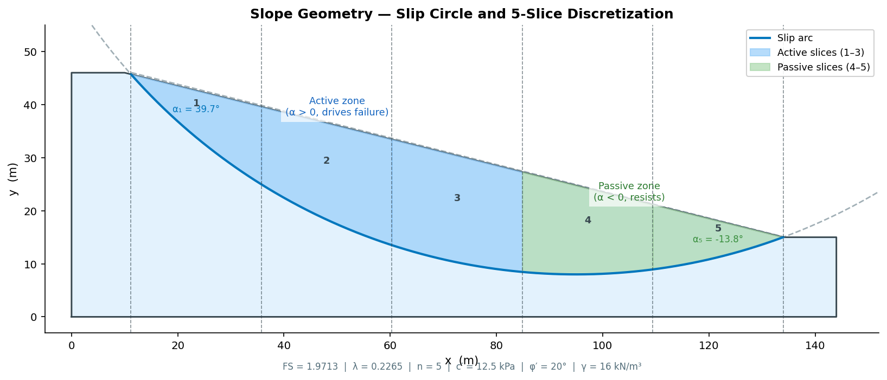
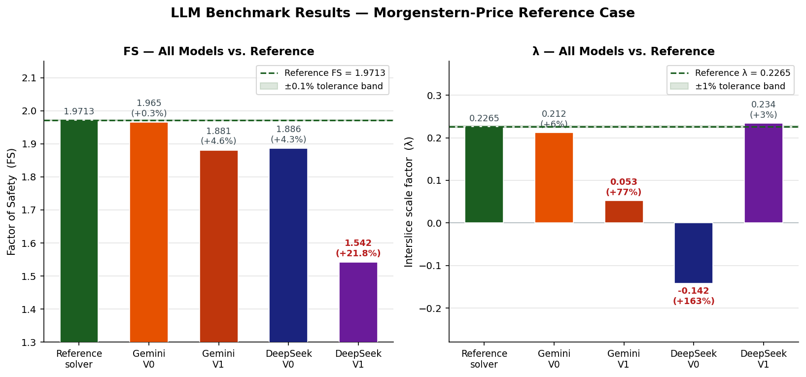
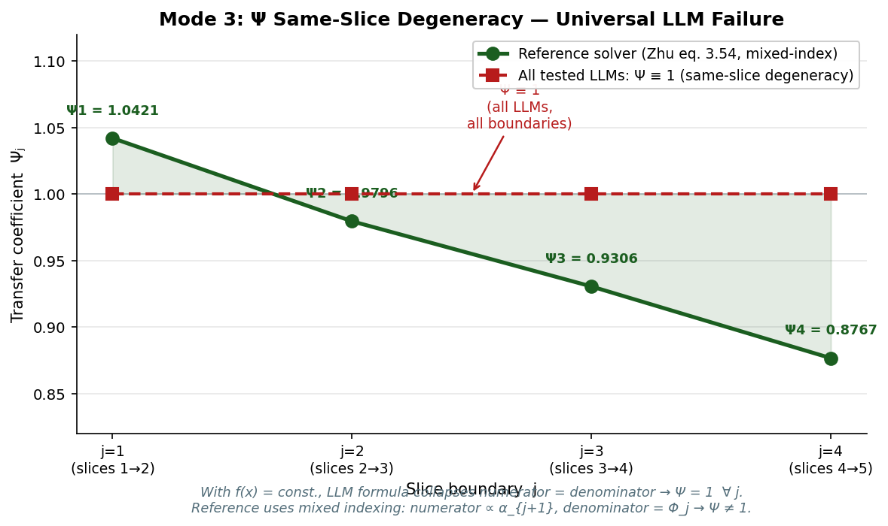
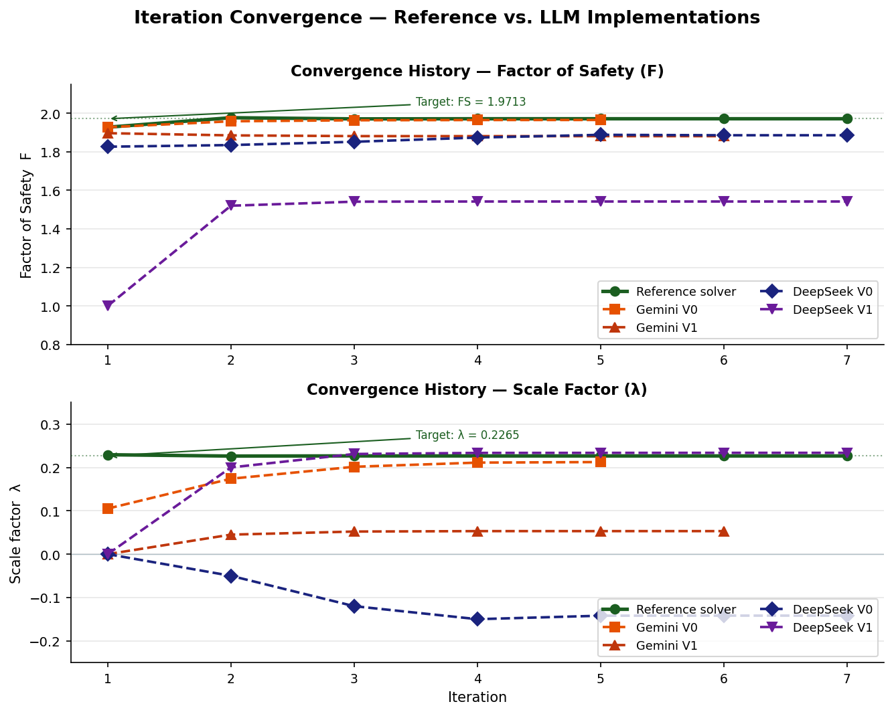

# geotech-llm-benchmark-mp-solver

Python implementation of the Morgenstern-Price limit-equilibrium method using the
**Zhu et al. (2005)** explicit iterative algorithm. Includes a structured LLM benchmark
for testing numerical reasoning and slope stability implementation accuracy.

## Intended Audience and Project Positioning

This repository serves two distinct but related audiences.

### 1. Geotechnical / Structural Engineering Reviewers

A fully self-contained, reference-quality Python implementation of the Morgenstern-Price
method following Zhu et al. (2005). The solver implements the exact closed-form recurrence
relations (eqs. 3.43–3.59) without relying on external root-finders. Benchmark results are
validated against Slope/W and Taludes_V13.

Useful for: cross-checking commercial software outputs, teaching limit-equilibrium theory,
or as a reference for clean numerical implementation of interslice equilibrium methods.

### 2. AI Evaluation / Red-Teaming Contexts

This repository doubles as a **quantitative STEM reasoning benchmark** for large language
models. The slope stability problem has a precisely known solution (FS = 1.9710, λ = 0.2260)
derived from multiple validated commercial tools. It requires:

- Correct mathematical derivation from first principles
- Faithful implementation of a multi-step recurrence algorithm
- Numerically exact output (tolerance 1×10⁻⁵)
- Structural understanding of interslice coupling (not solvable by pattern matching)

Empirical tests with Gemini 3.1 Pro Preview and DeepSeek v3.0 revealed
systematic failures in the transfer coefficient Ψ formulation, sign convention, and solver
strategy — failures that are visible only through structural inspection, not through
naive output comparison.

- Full failure taxonomy and fault tree: [`LLM_FAILURE_MODES.md`](LLM_FAILURE_MODES.md)
- Concise results summary: [`M-P_llm_tests/ANALYSIS_SUMMARY.md`](M-P_llm_tests/ANALYSIS_SUMMARY.md)

**Intended use:** AI evaluation platforms, recruiting technical assessments, reasoning
validation in quantitative engineering problems, red-teaming for scientific computing tasks.

---

## Figures

| | |
|:---:|:---:|
|  |  |
| **Fig 1** — Slope cross-section, slip arc, 5-slice discretization, active/passive zones | **Fig 2** — FS and λ for all tested models vs. reference. Every model fails. |
|  |  |
| **Fig 3** — Transfer coefficient Ψ: reference (non-unit, mixed-index) vs. all LLMs (Ψ ≡ 1). Universal structural failure. | **Fig 4** — Iteration convergence of F and λ. Reference reaches correct target in 7 steps; LLMs converge to wrong values. |

> Fig 5 (interslice force profile + thrust line) is in [`figures/fig5_interslice_forces.png`](figures/fig5_interslice_forces.png).  
> All figures generated by [`generate_figures.py`](generate_figures.py) from solver output.

---

## Why This Project

Limit-equilibrium slope stability is a classic problem in geotechnical engineering with
a well-defined algorithmic structure. It is:

- **Hard to pattern-match**: the correct Zhu et al. (2005) algorithm requires understanding
  mixed-index recurrences and inter-slice coupling, not just formula lookup
- **Easy to evaluate**: the reference solution is exactly known and validated by three
  independent commercial tools
- **Structurally diagnostic**: failures in specific sub-components (Ψ formula, α sign,
  f_left/f_right indexing) produce characteristic error signatures, enabling root-cause
  attribution

The combination makes it a **high-signal benchmark** for testing whether a model genuinely
implements an algorithm versus hallucinates a plausible-looking approximation.

---

## Problem Statement

A dry cohesive slope is analyzed for planar failure along a circular slip surface.

**Geometry:**
- Slope crest: (10.0, 46.0) m — slope toe: (134.0, 15.0) m
- Slip circle center: (95.0, 120.0) m, radius R = 112.0 m

**Soil parameters:**
- c' = 12.5 kPa, φ' = 20°, γ = 16.0 kN/m³, u = 0 kPa

**Numerical settings:**
- n = 5 equal-width slices, f(x) = 1.0 (Spencer/constant), tolerance = 1×10⁻⁵

The task is to compute the **Factor of Safety (FS)** against sliding and the **interslice
force scale factor (λ)** using the Zhu et al. (2005) explicit iterative formulation.

---

## Methods Implemented

**Core algorithm:** Morgenstern-Price limit-equilibrium method, Zhu et al. (2005) variant.
Satisfies both force equilibrium (FS formula, eq. 3.56) and moment equilibrium (λ formula,
eq. 3.59) simultaneously via explicit closed-form recurrences.

**Key equations** (dissertation eqs. 3.43–3.59):

| Symbol | Formula | Role |
|---|---|---|
| R̄ᵢ | Wᵢ cos αᵢ − uᵢ | Effective normal pre-factor |
| Rᵢ | R̄ᵢ tan φ' + c'·bᵢ/cos αᵢ | Resisting shear capacity |
| Tᵢ | Wᵢ sin αᵢ | Driving shear |
| Φᵢ | (sin αᵢ − λ·fᵣᵢ·cos αᵢ)·tan φ' + (cos αᵢ + λ·fᵣᵢ·sin αᵢ)·F | Slice denominator |
| Ψⱼ | [terms with α_{j+1}] / Φⱼ | Transfer coefficient — **mixed indexing** |
| F | Σ(Rᵢ·Pᵢ) / Σ(Tᵢ·Pᵢ),  Pᵢ = ∏ Ψⱼ | FS from force equilibrium |
| λ | Σ[bᵢ·(Eᵢ + Eᵢ₋₁)·tan αᵢ] / Σ[bᵢ·(fᵣᵢ·Eᵢ + fₗᵢ·Eᵢ₋₁)] | λ from moment equilibrium |

**α sign convention:** α > 0 in active zone (x_mid < x_center), α < 0 in passive zone.
Formula: `α = atan2(x_center − x_mid, y_center − y_bot)`.

**Interslice functions supported:**

| Option | Expression | λ (benchmark) |
|---|---|---|
| `"constant"` | f(x) = 1 (Spencer) | 0.2260 |
| `"half_sine"` | sin(π·(x−a)/(b−a)) | 0.2780 |

---

## Key Results

**Benchmark case — 5 slices, dry slope, no seismic loading**

| Source | FS | λ | f(x) |
|---|---|---|---|
| **This solver** | **1.9710** | **0.2260** | constant |
| **This solver** | **1.9710** | **0.2780** | half_sine |
| Slope/W | 1.971 | 0.316 | proprietary |
| Taludes_V13 | 1.971 | 0.278 | half_sine |
| Slide | 2.031 | N/A | unknown |

Key observations:

- FS = 1.971 is consistent across Slope/W, Taludes_V13, and this solver (< 0.01% deviation).
- FS is **independent of f(x)**; λ varies with interslice function shape.
- Convergence: **4 iterations** to tolerance 1×10⁻⁵ (matches dissertation exactly).
- Slide reports FS = 2.031 at n = 5; it converges toward 1.971 at higher slice counts.

**LLM benchmark results** (empirical, both models wrong):

| Model | Prompt | FS | λ | Primary failure |
|---|---|---|---|---|
| Gemini 3.1 Pro Preview | V0 | 1.965 | 0.212 | Ψ same-index degeneracy |
| Gemini 3.1 Pro Preview | V1 | 1.881 | 0.053 | Ψ = 1 (explicit) |
| DeepSeek v3.0 | V0 | 1.886 | −0.142 | α sign inverted + Ψ = 1 |
| DeepSeek v3.0 | V1 | 1.542 | +0.234 | α inverted + fsolve + E_n ≠ 0 |

See [LLM_FAILURE_MODES.md](LLM_FAILURE_MODES.md) for full analysis.

---

## Repository Layout

```
M-P/
│
├── README.md                          ← This file
├── LICENSE                            ← MIT License
├── .gitignore
├── LLM_FAILURE_MODES.md               ← Full LLM failure analysis (7 modes, fault tree)
│
├── inputs.py                          ← Problem definition (dataclasses)
├── discretizer.py                     ← Slice geometry builder
├── solver.py                          ← Zhu et al. (2005) iterative core
├── main.py                            ← Orchestration + 7-section reporting
├── generate_figures.py                ← Generates all figures from solver output
│
├── figures/
│   ├── fig1_slope_geometry.png        ← Slope cross-section + slip arc + slices
│   ├── fig2_llm_benchmark.png         ← FS and λ comparison (all models)
│   ├── fig3_psi_degeneracy.png        ← Ψ = 1 universal failure visualization
│   ├── fig4_convergence.png           ← Iteration convergence history
│   └── fig5_interslice_forces.png     ← E, X forces + thrust line
│
└── M-P_llm_tests/
    ├── ANALYSIS_SUMMARY.md            ← Concise summary of LLM test findings
    ├── FORENSIC_QUESTIONAIRE.md       ← Benchmark prompt used for forensic re-runs
    ├── prompts/
    │   ├── PROMPT_V0.md               ← Original benchmark prompt
    │   └── PROMPT_V1_CLEAN.md         ← Refined prompt (explicit Ψ eval, iteration log)
    └── results/
        ├── GEMINI_3.1_PRO_PREVIEW_RESULTS_PROMPT_V0.txt
        ├── GEMINI_3.1_PRO_FORENSIC_RESPONSE_v0.txt
        ├── GEMINI_3.1_PRO_PREVIEW_RESULTS_PROMPT_V1.txt
        ├── GEMINI_3.1_PRO_FORENSIC_RESPONSE_v1.txt
        ├── DEEPSEEK_PREVIEW_RESULTS_v0.txt
        ├── DEEPSEEK_FORENSIC_RESPONSE_v0.txt
        ├── DEEPSEEK_PREVIEW_RESULTS_v1.txt
        └── DEEPSEEK_FORENSIC_RESPONSE_v1.txt
```

---

## Quick Start

```
python -X utf8 main.py
```

The `-X utf8` flag is required on Windows to handle Unicode output (Greek symbols,
check marks) without codec errors.

`main.py` prints seven sections:

1. Input summary
2. Slice geometry table (x_mid, b, y_top, y_bot, h, α°, W, f_L, f_R)
3. Iteration log (F, λ, |ΔF|, |Δλ| per iteration)
4. GeoSlope-style per-slice report (N', σ_n, T_res, T_mob, E_L, E_R)
5. Interslice forces at each boundary (E, X, thrust-line height z = X/E)
6. Global equilibrium check (force residual, N' < 0 count, E < 0 count)
7. Benchmark comparison table

---

## Solver Architecture

### `inputs.py` — Problem Definition

Three dataclasses encode every input parameter:

| Class | Contents |
|---|---|
| `SlopeGeometry` | Crest/toe coordinates, circle center, radius |
| `SoilParams` | c', φ', γ (unit weight = **16 kN/m³**, confirmed from PDF Quadro 4.1) |
| `NumericalParams` | n_slices, F₀, λ₀, tolerance, `f_function` choice |

### `discretizer.py` — Slice Builder

`build_slices()` discretizes the sliding mass into *n* equal-width vertical slices:

1. Finds the two intersections of the slip circle with the slope surface by solving
   `A·x² + B·x + C = 0` (circle substituted into the slope line equation).
2. Divides `[x_entry, x_exit]` into *n* equal intervals.
3. For each slice, evaluates slope surface elevation `y_top(x_mid)` and lower arc
   elevation `y_bot(x_mid)` analytically.
4. Computes base inclination angle α from the circle tangent:
   ```
   α = atan2(x_center − x_mid, y_center − y_bot)
   ```
   Sign convention: **α > 0 in the active zone** (x_mid < x_center);
   **α < 0 in the passive zone** (x_mid > x_center).
5. Evaluates the interslice function `f(x)` at each vertical boundary.

### `solver.py` — Zhu et al. (2005) Core

`MPSolver.solve()` runs the explicit iteration without calling any numerical root-finder.
F and λ are updated alternately each iteration using closed-form expressions.
Convergence criterion: both |ΔF| < tol AND |Δλ| < tol (default 1×10⁻⁵).
The benchmark case converges in **4 iterations**.

`MPResult` carries the full solution: FS, λ, E[n+1], X[n+1], N'[n], T_res[n], T_mob[n],
σ_n[n], and the global force residual E[n] (should be ≈ 0).

---

## LLM Benchmark Testing

This repository includes a structured two-layer testing framework for evaluating LLM
implementations of the Morgenstern-Price method.

**Layer 1 — Primary Prompt** (`M-P_llm_tests/prompts/PROMPT_V1_CLEAN.md`):
Clean benchmark prompt. No hints, no expected ranges, no "WRONG" labels.
Failures emerge naturally from the algorithm.

**Layer 2 — Forensic Questionnaire** (F1–F7 structure, documented in `LLM_FAILURE_MODES.md`):
Post-hoc diagnostic. Apply only when FS deviates > 0.1% or λ deviates > 1%.
Seven questions isolate specific failure modes without teaching the benchmark.
Not yet tested empirically; V1 prompt embeds equivalent structural probes in B2 and B4.

**Failure modes identified so far:**

| # | Mode | Observed in |
|---|---|---|
| 1 | α sign inverted → λ < 0 | DeepSeek V0, V1 |
| 2 | fsolve black-box instead of explicit recurrence | DeepSeek V1 |
| 3 | Ψ same-slice degeneracy → Ψ = 1 for constant f(x) | All tested models |
| 4 | Boundary condition E_n ≠ 0 | DeepSeek V1 |
| 5 | f_left/f_right indexing (unconfirmed, requires non-constant f) | — |
| 6 | γ default substitution (not triggered) | — |
| 7 | Internally consistent wrong algorithm | Gemini V0 |

Full analysis: [LLM_FAILURE_MODES.md](LLM_FAILURE_MODES.md)

---

## Honest Limitations

- **Single geometry tested:** All results derive from one benchmark case (5 slices, circular,
  dry). Failure mode severity may differ for steeper slopes, more slices, or seepage.
- **f(x) = constant only in primary runs:** Modes related to f_left/f_right indexing
  (Mode 5) cannot be confirmed from these data; they require testing with `half_sine`.
- **No formal test suite:** Correctness is validated against benchmarks, not automated
  unit tests. A regression suite with pytest would improve reproducibility.
- **Forensic applied in same window:** The forensic questionnaire was applied in the same
  conversation session as the primary prompt. Fresh-window forensic behavior is unknown.
- **Two models tested:** Gemini 2.0 Flash Exp and DeepSeek Reasoner. Results should not
  be generalized across all LLMs without additional experiments.
- **LLM outputs are empirical data, not validated solutions.** They are preserved as-is.
  No model output has been corrected or adjusted in the analysis.

---

## Dependencies

- Python ≥ 3.10
- `numpy`

No other third-party packages are required.

---

## References

1. Zhu, D.Y., Lee, C.F., Qian, Q.H., Chen, G.R. (2005). *A concise algorithm for computing
   the factor of safety using the Morgenstern-Price method.* Canadian Geotechnical Journal,
   42(1), 272–278.

2. Morgenstern, N.R., Price, V.E. (1965). *The analysis of the stability of general slip
   surfaces.* Géotechnique, 15(1), 79–93.

3. Fellenius, W. (1936). *Calculation of stability of earth dam.* Transactions, 2nd Congress
   on Large Dams, Washington, D.C., Vol. 4, pp. 445–463.

4. GeoSlope International (2012). *Stability Modeling with SLOPE/W.* Calgary, Canada.

5. Rodrigues, A. (dissertation source). *Análise de Estabilidade de Taludes pelos Métodos
   de Morgenstern-Price e Correia.* (Reference case: Example 1, Case 1, Quadro 4.1.)
